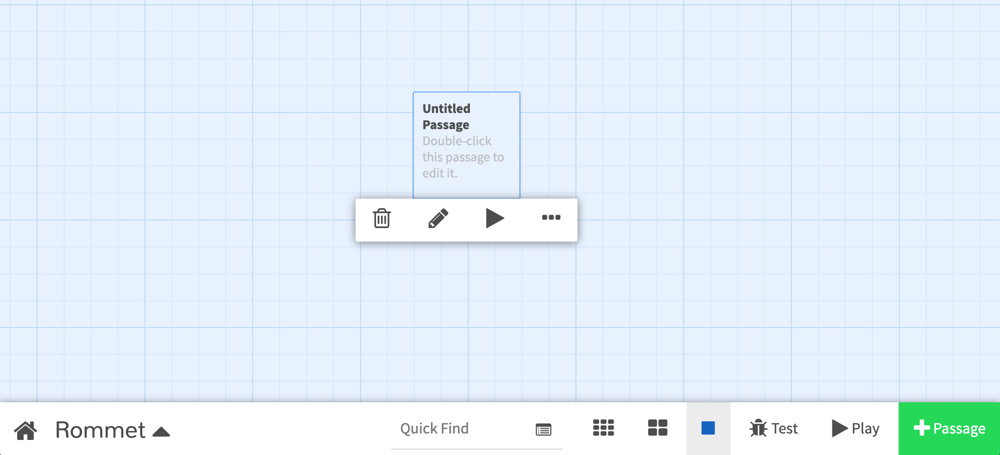
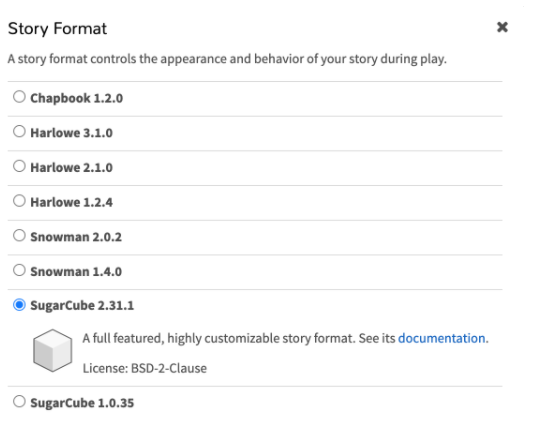
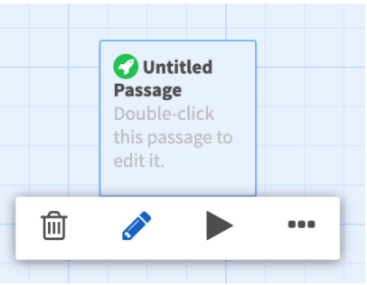
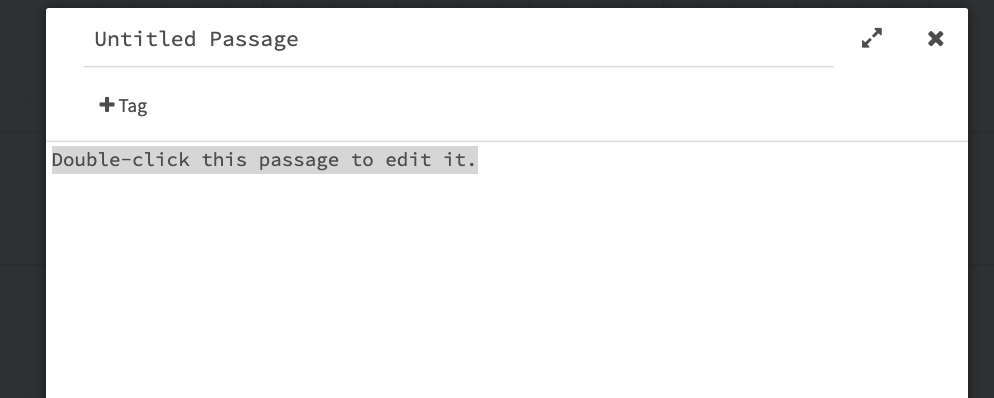

# Introduksjon {.intro}
#
I denne oppgåva kjem me til å skrive ei interaktiv forteljing, eller tekstbasert spel. Lesaren av resultatet kan velje utviklinga i forteljinga.

# Steg 1: Skriv byrjinga på forteljinga {.activity}

## Sjekkliste {.check}

- [ ] Åpne [twinery](http://twinery.org/2){target=_blank} i ei ny fane. For å skrive din aller fyrste historie, trykk på `+story`-knappen og skriv namnet til forteljinga: «Rommet».


- [ ] No ser skjermen slik ut:




- [ ] Trykk på pila til høgre for namnet til spelet (her: Rommet). Trykk deretter på `Change story format`.


- [ ] Vel `Sugarcube 2.31.1`



- [ ] I Twine er kvar forteljing laga av fleire «Passage» (passasje), og kvar «Passage» ligg i ein boks. Trykk på den eine boksen og trykk deretter på blyanten for å skrive din fyrste «Passage»:



- [ ] No ser du ein boks som blir brukt til å redigera denne passasjen. Tittelen til passasjen kjem ikkje til å vera synleg når folk spelar di forteljing. I staden for `Double-click this passage to edit it` skriv du det som skal vera synleg i spelet.



- [ ] Gje passasjen tittelen `introduksjon`.

- [ ] Byt ut `Double-click this passage to edit it`  med:
```diverse
Du har vakna i eit rom. Du veit ikkje kor du er. Hugsar ingenting.
```
#

## Test prosjektet {.flag}
Du kan no stenga passasjen (x). Prøv spelet ved å trykkja på «play».

#


# Steg 2: Gje fleire val til lesaren  {.activity}

No skal me utvida spelet.

## Sjekkliste {.check}

- [ ] Sidan det berre er ein tekst i forteljinga, er det ingen ting lesaren kan gjera. Du kan no stenga spelet og legga til fleire passasjar. La oss gje lesaren moglegheita til å gå ut. Skriv i slutten av `introduksjon` boksen:

```diverse
[[Du ser rundt deg.->start]]
```

`Du ser rundt deg` er valget lesaren kan ta. `start` er tittelen på passasjen der lesaren skal om han/ho trykkjer på `Du ser rundt deg`.

- [ ] Fjern passasjen ved å trykkja på `x`. No ser du ein ny boks: du har tilsett ein ny passasje! Han heiter `start`. La oss redigera han. Åpne han og skriv inn:
```diverse
Du er i eit rom. Du ser ei dør. Du må gå ut! Kva gjer du?
```

- [ ] La oss gje 2 moglegheiter til lesaren: åpna døra eller ta ein tur i rommet. Skriv under spørsmålet:
```diverse
[[åpna døra->utgang]]
[[ta ein tur rundt->rom]]
```
No har du 2 passasjar til: `utgang` og `rom`.

## Test prosjektet {.flag}
Ved å trykkja på «play».

#

## Utfordring {.challenge}
Kan du legga til eit bilete i passasjen?
### Tips
Koden for å tilsetta eit bilete er:
``
Vel sjølv eit bilte på nett, kopier adressa, og lim den inn etter `src=`. Hugs hermeteikna: `“”`.  
Skriv ein kort beskrivelse av bildet etter `alt=`. Hugs hermeteikna: `""`.
#

## Prøv sjølv {.try}
Prøv å forandra nummeret som ligg etter “height” og “width”. Kva forskjell gjer det når du spelar spelet?
#

# Steg 3: Opna døra med ein nøkkel  {.activity}

## Sjekkliste {.check}

- [ ] for å åpne døra treng lesaren ein nøkkel. Viss han har nøkkelen, kan han gå ut. Til det må me laga ein variabel som heiter $harNøkkel. Den kan vera true (sann) når lesaren har ein nøkkel, eller false (usann) når lesaren ikkje har nøkkelen. Rediger “introduksjon” slik at lesaren ikkje har nøkkelen i byrjinga. Skriv over `Du har vakna i eit rom. Du veit ikkje kor du er. Hugsar ingenting.`:
```diverse
<<set $harNøkkel to false>>
```
som betyr: sett $harnøkkel til usann.

- [ ] No kan me endra passasjen som heiter «utgang» og skrive denne koden, for å opna døra om lesaren har nøkkelen:
```diverse
<<if $harNøkkel is true>>Du brukar nøkkelen din. Døra opnar, du er fri.
```

- [ ] rett under det, vil me skrive kva som skal skje om lesaren ikkje har nøkkelen. Han kan ikkje åpne døra og må tilbake til byrjinga.
```diverse
<<elseif $harNøkkel is false>>Du prøver å åpne døra. Du treng ein nøkkel. [[Leit etter nøkkelen->start]].
<</if>>
```

## Test prosjektet {.flag}
Ved å trykkja på «play».

#


## Utfordring {.challenge}
Legg til eit bilete som lesaren kan sjå når han/ho har kome ut av spelet (under teksten «Du brukar nøkkelen din. Døra opnar, du er fri.»).
### Tips
Kode til bilete bør du skrive under «Du brukar nøkkelen din. Døra opnar, du er fri.», men over "Du prøver å åpne døra. Du treng ein nøkkel."
#

# Steg 4: Gøym nøkkelen i rommet {.activity}

## Sjekkliste {.check}

- [ ] Når lesaren er i rommet, kan han/ho velja å utforska fleire ting:
```diverse
Rommet er grått og står nesten tomt. Du ser ein [[boks->boks]], eit [[røyr->røyr]] som ligg på golvet og ein [[spegel->spegel]].
```
No har du lagt til tre passasjar: `boks`, `røyr` og `spegel`.

## Utfordring {.challenge}
- Kan du sjølv skrive passasjen `boks`? Nøkkelen er ikkje i boksen, boksen er tom. Lesaren kan velja å gå tilbake til rommet.
##

- [ ] Skriv kode for å gå tilbake til rommet:
```diverse
[[Gå tilbake.->rom]]
```

## Utfordring {.challenge}
- Kan du legge til ein moglegheit til å gå tilbake til døra (start) frå rom-passasjen?
### Tips
Slik kan du gjera:
```diverse
[[Val som lesaren kan ta. -> tittel på passasjen der lesaren skal]]
```
##

- [ ] Skriv følgjande i `røyr`-passasjen:
```diverse
Røyret er tomt. Du tar det med deg, kanskje du treng det seinare.
```

## Utfordring {.challenge}
Kan du kode forteljinga slik at lesaren får med seg røyret i denne passasjen? Kall variabelen for `$harRøyr`.
### Tips
Her er kode som du må redigera:
`<<set $namnVariabel to true>>`.
##

- [ ] Skriv koden slik at det er mogleg å gå tilbake til rommet.
```diverse
[[Leit vidare->rom]].
```

- [ ] Skriv passasjen som heiter `spegel`:
```diverse
Spegelen står fast på veggen. Du må knusa han for å sjekka om noko ligg bak.
```

- [ ] Og bruk eit vilkår. Om lesaren har røyret, så kan han knusa spegelen, og då finn han nøkkelen.
```diverse
<<if $harRøyr is true>> Du brukar røyret for å knusa spegelen. Du finn ein nøkkel bak spegelen. <<set $harNøkkel to true>> [[Gå til døra.->start]]
```

- [ ] Ellers kan han ikkje knusa spegelen:
```diverse
<<else>> Du treng noko for å knusa spegelen. [[Gå tilbake.->rom]]
<</if>>
```

## Test prosjektet {.flag}
Ved å trykkja på «play».

#


# Steg 5: Legg til stil {.activity}

- [ ] Trykk på pila til høgre for “Rommet”, og deretter på «Edit Story Stylesheet»:


- [ ] Lim inn denne koden:
```diverse
body{
  background-color:white;
  color:black;
  font-family:futura;
  font-size:14px;
}
```

# Prøv sjølv {.try}
Prøv å forandra fargen eller fonten!
### Tips
Du kan finna ein fargekatalog på https://www.w3schools.com/colors/colors_names.asp
#

## Test prosjektet {.flag}
Ved å trykkja på «play».

#

# Steg 6: Utvid forteljinga! {.activity}

Legg til passasjar for å gjera forteljinga meir spennande!

### Tips {.tip}
- Namnet på ein variabel ser slik ut: `$namnVariabel`
- Ein variabel kan ha fleire verdiar:

   **tal**, t.d. `<<set $talVariabel to 5>>`,

  **sant/usant** (true/false), t.d. `<<set $alive to true>>`,

  **eit ord** (kalla ein «string»), som må ha hermeteikn, t.d. `<<set $spelarNamn to “Simone”>>`
- Viss du vil auka ein tal-variabel med 1 kan du skrive `<<set $talVariabel += 1>>`
#

# Steg 7: Del forteljinga di {.activity}

- [ ] Trykk på heim-ikonet (huset).
- [ ] Frå heim, trykk på tannhjulikonet og deretter på `publish to file`. Då lastar du ned spelet ditt.
- [ ] denne fila kan du dela med andre, for eksempel ved å senda det per e-post. Dei som vil spela kan lasta det ned og spela på eiga maskin.
